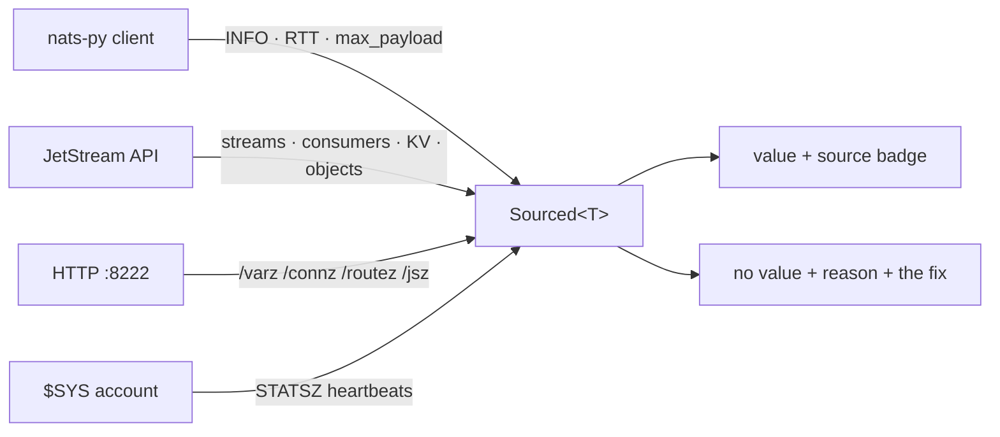

<div align="center">


# nats-lens

**A NATS management GUI that says where every number came from.**

[](https://github.com/nats-lens/lens/releases)
[](https://github.com/nats-lens/lens/pkgs/container/lens)
[](https://github.com/nats-lens/lens/actions/workflows/release.yml)
[](LICENSE)

<sub>Python 3.14 · Litestar · msgspec · nats-py · React 19 · Vite 7 · Tailwind v4 · SQLite</sub>

</div>

---

## The problem this solves

Most NATS dashboards show you a number. Few of them can tell you whether it is
*true*.

A NATS client sees less than a dashboard usually pretends. `nats-py` gives you
per-client facts — server INFO, round-trip time, max payload, your own counters —
plus the whole JetStream, KV and object-store API. It does **not** give you
server-wide counters. Connections, subscriptions, slow consumers, throughput and
routes are simply not in the client protocol. They need the HTTP monitoring port
(off by default, `http_port: 8222`) or a `$SYS` account connection.

So a dashboard connected as a plain client has three options. It can hide those
panels, it can guess, or it can show a zero. **A zero is the worst of the three,**
because it is indistinguishable from a real one — an idle broker and an
unobservable broker look identical.

nats-lens takes the fourth option: every figure carries the source it came from,
and where that source is not configured the screen names the fix instead.

| Badge | Where the number came from | Needs |
|:--|:--|:--|
| `client` | The client protocol — INFO, RTT, max payload | nothing |
| `jetstream` | The JetStream API — streams, consumers, KV, objects | JetStream enabled |
| `monitor` | The HTTP monitoring port — `/varz`, `/connz`, `/routez`, `/jsz` | `http_port: 8222` |
| `system` | `$SYS.SERVER.*.STATSZ` heartbeats | a `$SYS` user |
| `sampled` | An observation nats-lens made itself, not a server total | nothing |

### It is enforced, not remembered

- The API returns `Sourced[T]` — either a value **and** its source, or no value
  and the reason **plus the remedy**. There is no third shape.
  <sub>`backend/nats_lens/provenance.py`</sub>
- A meta-test walks every response type in the schema and fails the build if a
  server-wide counter is reachable as a bare number.
  <sub>`tests/unit/test_contract.py`</sub>
- The integration suite runs **two** NATS containers — one with monitoring and
  `$SYS`, one with neither — so the honest empty state is a test, not a promise.
  <sub>`tests/integration/`</sub>



---

## Quick start

### Run the published image

```bash
docker run -d --name nats-lens -p 8000:8000 \
  -v nats-lens-data:/data \
  -e NATS_LENS_SECRET_KEY="$(openssl rand -base64 32)" \
  ghcr.io/nats-lens/lens:latest
```

Open <http://localhost:8000> and register your first server.

> [!IMPORTANT]
> Keep `NATS_LENS_SECRET_KEY` somewhere safe — print it before you paste it.
> Your stored NATS credentials are encrypted with it, and losing it means
> re-entering them. It does not lose the registry.

One container, no database to run, `linux/amd64` and `linux/arm64`.

<details>
<summary>Using a host directory instead of a named volume</summary>

The container runs unprivileged as uid `10001`, so a bind-mounted directory has
to be writable by it — Docker does not adjust ownership on bind mounts the way it
does for named volumes:

```bash
mkdir -p ./data && sudo chown -R 10001:10001 ./data
docker run -d --name nats-lens -p 8000:8000 \
  -v "$PWD/data:/data" \
  -e NATS_LENS_SECRET_KEY="$(openssl rand -base64 32)" \
  ghcr.io/nats-lens/lens:latest
```

</details>

### Or bring up the whole development stack

```bash
docker compose -f docker-compose.dev.yml up --build
```

| | |
|:--|:--|
| UI | <http://localhost:5173> |
| API | <http://localhost:8000/schema> |
| NATS | `nats://localhost:4222` |
| Monitoring | <http://localhost:8222> |

Then fill it with something to look at:

```bash
docker compose -f docker-compose.dev.yml --profile demo run --rm seed
```

The dev NATS server ships with JetStream, the monitoring port **and** a `$SYS`
account, so all three configurable telemetry sources work out of the box.

---

## What's in it

| Screen | What it does |
|:--|:--|
| **Servers** | The registry, live connection state, and what each server can and cannot tell you |
| **Core** | Subscribe, publish, request — with every payload run through the decoding chain |
| **JetStream** | Streams and consumers: create, edit, purge, pause, replay; per-subject counts; stored messages |
| **Key–Value** | Buckets, keys, revision history, and compare-and-set writes that refuse to clobber |
| **Object store** | Buckets, uploads streamed from the request, digests, sealing |
| **Schemas** | Protobuf descriptors, subject→type rules with precedence, and a live decoder |
| **Advisories** | JetStream advisories as they happen, with the consumer that caused them |
| **Monitor** | `/varz`, `/connz`, `/subsz`, `/routez`, `/healthz` — the things only the monitoring port knows |

### Protobuf definitions

JSON and MessagePack are read straight off the bytes. Protobuf needs a schema,
and there are two ways to give nats-lens one.

**Mount a directory.** The one to prefer when your `.proto` files import each
other:

```bash
docker run -d --name nats-lens -p 8000:8000 \
  -v nats-lens-data:/data \
  -v "$PWD/protos:/protos:ro" \
  -e NATS_LENS_SECRET_KEY="$(openssl rand -base64 32)" \
  ghcr.io/nats-lens/lens:latest
```

The tree is scanned on start and whenever you press **Rescan** on the Schemas
screen. Each file is compiled *inside the tree*, so `import "common/money.proto"`
resolves against the files beside it. nats-lens never writes there, and never
deletes from there — remove a file and rescan, and its types go with it.

**Or upload through the UI.** Schemas → the **+** on the descriptors list. Send a
`.proto`, or a `FileDescriptorSet` for anything with imports:

```bash
protoc -I ./protos --include_imports --descriptor_set_out=schema.desc ./protos/invoice.proto
```

An upload is compiled on its own, so a bare `.proto` that imports another of your
files cannot work — protoc only sees the one file. The error says exactly that,
in protoc's own words with the file, line and column.

Uploads are written to **`/data/uploads/protos`** as well as the registry, so
they are files you can list, copy and back up rather than rows locked in a
database. That directory is inside the `/data` volume, so they survive upgrades
along with everything else.

| | Mounted (`/protos`) | Uploaded (`/data/uploads/protos`) |
|:--|:--|:--|
| Imports between your files | resolve against the tree | need a `FileDescriptorSet` |
| Written by | you | nats-lens |
| Deletable in the UI | no — remove the file and rescan | yes |
| Good for | a schema repo you already version | a one-off, or a quick look |

**Then map subjects to types.** A descriptor decodes nothing on its own. On
Schemas → Subject rules, pick the type from the search box — it lists every
registered type from both sources — and give it a subject pattern. Most specific
wins: `orders.new` beats `orders.*` beats `orders.>`, whatever order you added
them in.

If your publishers already set a `Nats-Msg-Type` header naming the full type, you
can skip rules entirely; that is step 1 of the chain and it beats everything else.

### The decoding chain

A payload is bytes. nats-lens resolves it in five steps and **always** terminates:

```
1. header          a Nats-Msg-Type header — a publisher naming its own type wins
2. subject rule    your subject→type mapping, most specific pattern first
3. content-type    a Content-Type header
4. sniff           shape of the bytes: JSON, MessagePack, UTF-8 text
5. wire format     raw protobuf — field numbers and wire types, no schema
```

Step 5 is the floor: an unmapped protobuf message still renders as
`varint 214`, `fixed32 21.4 · 0x41ab3333`, `len 11 "device-4471"` — field numbers
and wire types, which is the honest answer when no descriptor is registered.

---

## Configuration

| Variable | Default | What it does |
|:--|:--|:--|
| `NATS_LENS_SECRET_KEY` | *required* | Base64 32-byte key. Encrypts stored NATS credentials |
| `DATABASE_URL` | `sqlite+aiosqlite:////data/nats-lens.db` | The registry |
| `NATS_LENS_PORT` | `8000` | Listen port |
| `NATS_LENS_STATIC_DIR` | `/srv/static` | Where the built SPA lives |
| `NATS_LENS_PROTO_DIR` | `/protos` | A directory of `.proto` files to scan. Mount yours here |
| `NATS_LENS_PROTO_UPLOAD_DIR` | `/data/uploads/protos` | Where UI uploads are kept |
| `NATS_LENS_CORS_ORIGINS` | *unset* | Only needed if you serve the SPA from another origin |

### Credentials

A container has no OS keychain, so NATS credentials are sealed with **AES-GCM**
under `NATS_LENS_SECRET_KEY` and stored as ciphertext in a table separate from the
server record. They are opened only to hand to `nats-py` at connect time —
`RawCredentials` means a `.creds` file never touches disk — and **no API response
can carry one**, which is itself a test.

### State

Everything nats-lens remembers lives under `/data`: the registry at
`/data/nats-lens.db` — servers, protobuf descriptors, subject rules, saved
filters — and uploaded proto definitions as files under
`/data/uploads/protos`. It is a
handful of small tables written by a single process, so a file is the right shape
— it survives `docker compose down -v`, backs up by being copied, and opens in any
sqlite client.

nats-lens keeps **no history and no time series**. It is a live view. For history,
point `prometheus-nats-exporter` at the same monitoring port.

> [!NOTE]
> nats-lens holds its NATS connections in-process and **must run with one worker**.
> It refuses to start otherwise, rather than silently serving two inconsistent views.

---

## Development

```bash
uv sync --all-groups

uv run pytest                     # unit suite — no Docker needed
uv run pytest -m integration      # testcontainers: two NATS servers
uv run pytest -m ""               # everything, which is what CI runs
uv run ruff check backend tests tools scripts
uv run ty check                   # ty, not mypy

cd frontend && npm run types      # regenerate the API client from the schema
```

`frontend/src/lib/api.d.ts` is the contract between the two halves, and it is
**generated — never hand-edited**. `npm run types` exports the schema from the app
and regenerates it in one step; that export needs no database, no NATS and nothing
running. A backend change that drifts from the frontend breaks the build rather
than production.

### Layout

```
backend/nats_lens/
  provenance.py       Sourced[T] — the contract that makes the badges honest
  conn/               connections, monitoring client, subscription fan-out
  codec/              the five-step decoding chain
  domain/<screen>/    schemas.py (frozen) + controller.py + service.py
  domain/nats_access  connect + check + translate, shared by JetStream, KV, objects
frontend/src/
  components/         the design system — tokens in index.css, primitives in ui/
  features/<screen>/  one folder per screen, one lazy chunk per route
  lib/api.d.ts        generated — do not edit
```

The UI follows a design canvas drawn before any code: ten artboards and a
Foundations sheet. Source comments name the artboard they came from, and
`frontend/src/index.css` is where its tokens live — 43 of them, each with a
light counterpart.

### Runtime

Served by [Granian](https://github.com/emmett-framework/granian) on uvloop. HTTP
and WebSocket framing happen in Rust, so the image carries neither `h11`/`httptools`
nor the Python `websockets` library — the Python side only ever sees ASGI events.

---

## Releases

Publishing a GitHub release runs the full suite — unit **and** integration, the
latter against real NATS containers — then builds and pushes a multi-architecture
image to `ghcr.io/nats-lens/lens`, tagged `X.Y.Z`, `X.Y`, `X` and `latest`, with
build provenance attested. A prerelease publishes its version tags but never
moves `latest`.

```bash
docker pull ghcr.io/nats-lens/lens:latest
docker pull ghcr.io/nats-lens/lens:0.1.0
```

---

## License

[PolyForm Noncommercial License 1.0.0](LICENSE) — **free for any noncommercial
purpose**, including personal projects, research, education, charities and
government. Commercial use requires a separate license; open an issue to ask.

Note that a noncommercial restriction is not open source under the OSI definition,
so please don't rely on it being one.
